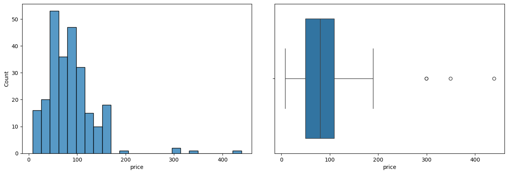
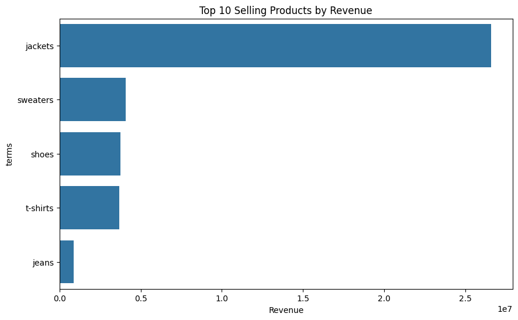
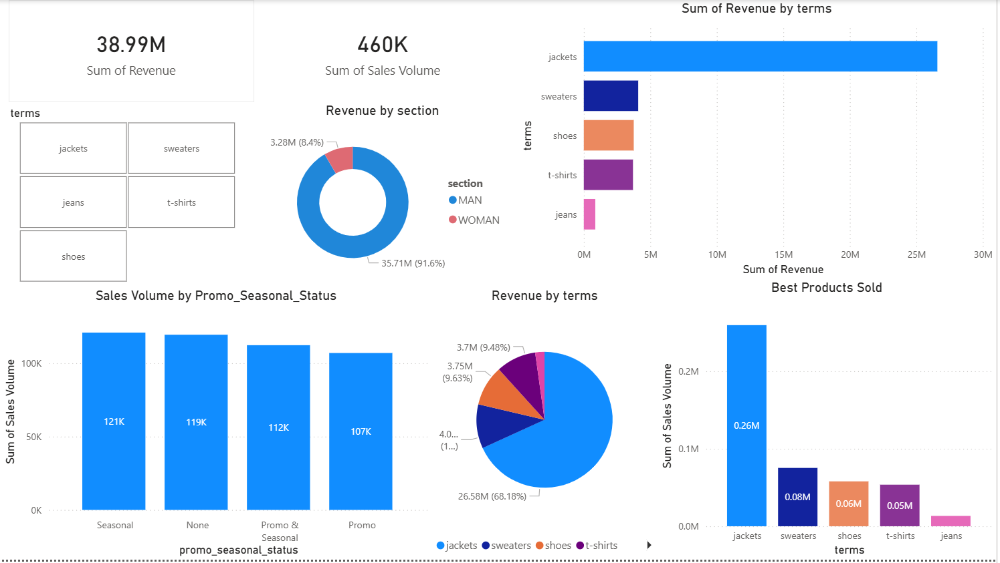

# Zara-Sales-Analysis

## Project Overview
This project is to analyze Zara sales dataset to identify trends, sales performance, and insights for decision making and marketing strategy.

You can view the full project here:  
- [View Notebook in Colab](https://colab.research.google.com/github/YTChiew/Zara-Sales-Analysis/blob/main/zara_sales_analysis.ipynb)
- [Download Power BI Dashboard (.p)](https://github.com/YTChiew/Zara-Sales-Analysis/blob/main/Zara%20Analysis.pbix)

---

## Dataset
- Source: Kaggle Zara sales dataset
- Features: Product ID, Product Position, price, Sales Volume, Promotion, Seasonal, and section.

---

## Tools Used
- Python (Pandas, NumPy, Matplotlib, Seaborn)
- Jupyter Notebook
- Power BI
    - Power Query (ETL, data cleaning & transformation)
    - DAX (calculated measures & KPIs)

---

## Analysis Steps
1. Data preprocessing
2. Exploratory Data Analysis (EDA)
3. Revenue & product trend analysis
4. Dashboard creation (Power BI)
5. Visualizations & Insights

---
## Power BI Dashboard

### Key Features
- Interactive dashboard for analyzing sales performance
- Visualizations for revenue trends, product performance, and sales distribution

### Data Transformation (Pwer Query/ DAX)
- Created calculated columns using conditional logic (IF ELSE statements) to categozire data
- Derived revenue column from sales volume and price
- Performed basic data cleaning for analysis 

---

## Key Business Questions:
- What are the 10 selling products by Revenue?
- Do promotional or seasonal items affects sales volumes?
- Which product categories genetate the highest revenue?
- Does product placements affect sales volumes?

---

## Key Insights:
- Jackets contribute the majority of total revenue, indicating strong demand in this category
- Seasonal items shows higher sales volume compare to non-seasonal items, suggesting seasonility significantly impacts purchasing behavior
- Products that are places at aisle generate higher sales volume compared to those positioned at front or end-cap, highlighting the influence of in-store product placement
  
---

## Visualizations

